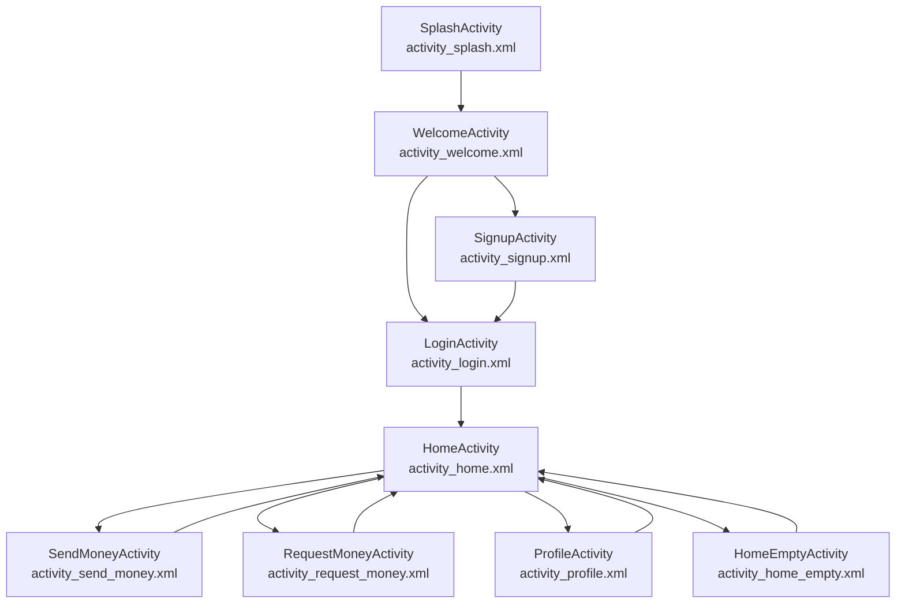

# Alke Wallet

Proyecto de billetera virtual desarrollado como entrega de los **Módulos 4 y 5**.

La aplicación se centra en el **diseño de la interfaz y el flujo visual** de una wallet digital, y en este módulo se extiende con una **arquitectura Modelo–Vista–Controlador (MVC)** para manejar la administración de fondos, las transacciones y la persistencia simple de datos entre pantallas.

La app permite:

- Simular inicio de sesión y registro.
- Consultar el balance de la cuenta.
- Ingresar (depositar) dinero.
- Enviar (retirar) dinero.
- Visualizar un listado dinámico de transacciones.

> No se implementa lógica real de autenticación contra un backend ni operaciones financieras reales; todo ocurre de forma local en el dispositivo.

---

## Tecnologías utilizadas

- **Lenguaje:** Kotlin  
- **Entorno:** Android Studio  
- **UI:** Layouts XML (ConstraintLayout, LinearLayout, CardView, RecyclerView)  
- **Persistencia simple:** `SharedPreferences` para el saldo  
- **Arquitectura:** MVC (Modelo, Controlador, Vistas en Activities + XML)  

---

## Arquitectura MVC (Módulo 5)

### Modelo (`model/`)

Contiene las clases que representan los datos y la lógica de negocio de la billetera:

- `TransactionType.kt`  
  Enum con los tipos de transacción: `INGRESO` y `ENVIO`.

- `Transaction.kt`  
  Data class que modela una transacción: id, tipo, monto, nota y fecha.

- `WalletRepository.kt`  
  Objeto responsable de:
  - Mantener el **saldo actual**.
  - Mantener una lista en memoria de **transacciones**.
  - Persistir el saldo en `SharedPreferences` para conservarlo entre ejecuciones.
  - Exponer métodos de negocio:
    - `getBalance(context)`
    - `getTransactions()`
    - `deposit(context, amount, note)`
    - `send(context, amount, note)` (valida saldo suficiente).

### Controlador (`controller/`)

Capa intermedia que orquesta la lógica entre las Vistas (Activities) y el Modelo:

- `WalletController.kt`  
  - Envuelve a `WalletRepository` y expone métodos de alto nivel para las Activities.  
  - Valida montos, traduce resultados a códigos de estado y simplifica el uso del modelo desde la UI.

- `WalletSendResult.kt`  
  Enum para los resultados de un envío de dinero:
  - `SUCCESS`
  - `INSUFFICIENT_FUNDS`
  - `INVALID_AMOUNT`

Gracias a esta capa, las Activities no acceden directamente al repositorio, sino que delegan la lógica de negocio al controlador.

### Vistas (`ui/` + `res/layout/`)

Las Vistas están formadas por:

- **Activities** en `ui/` que actúan como controladores de UI:
  - `SplashActivity`
  - `WelcomeActivity`
  - `LoginActivity`
  - `SignupActivity`
  - `HomeActivity`
  - `HomeEmptyActivity`
  - `ProfileActivity`
  - `SendMoneyActivity`
  - `RequestMoneyActivity`

  Cada Activity:
  - Lee valores de los elementos de la interfaz (EditText, Button, TextView).
  - Llama a los métodos del `WalletController`.
  - Actualiza la UI con los resultados (por ejemplo, saldo actualizado, mensajes de error, cierre de pantalla).

- **Layouts XML** en `res/layout/`:
  - `activity_splash.xml`
  - `activity_welcome.xml`
  - `activity_login.xml`
  - `activity_signup.xml`
  - `activity_home.xml`
  - `activity_home_empty.xml`
  - `activity_profile.xml`
  - `activity_send_money.xml`
  - `activity_request_money.xml`
  - `item_transaction.xml` (fila individual del RecyclerView de transacciones).

Los layouts se encargan solo del diseño: posiciones, colores, textos y estilos.

---

## Estructura de carpetas del proyecto

```text
.
├── app
│   ├── build.gradle.kts
│   ├── proguard-rules.pro
│   └── src
│       ├── androidTest
│       │   └── java
│       │       └── com/cjgr/awandroide/ExampleInstrumentedTest.kt
│       ├── main
│       │   ├── AndroidManifest.xml
│       │   ├── java
│       │   │   └── com/cjgr/awandroide
│       │   │       ├── MainActivity.kt
│       │   │       ├── model
│       │   │       │   ├── Transaction.kt
│       │   │       │   ├── TransactionType.kt
│       │   │       │   └── WalletRepository.kt
│       │   │       ├── controller
│       │   │       │   ├── WalletController.kt
│       │   │       │   └── WalletSendResult.kt
│       │   │       └── ui
│       │   │           ├── HomeActivity.kt
│       │   │           ├── HomeEmptyActivity.kt
│       │   │           ├── LoginActivity.kt
│       │   │           ├── ProfileActivity.kt
│       │   │           ├── RequestMoneyActivity.kt
│       │   │           ├── SendMoneyActivity.kt
│       │   │           ├── SignupActivity.kt
│       │   │           ├── SplashActivity.kt
│       │   │           ├── TransactionAdapter.kt
│       │   │           └── WelcomeActivity.kt
│       │   └── res
│       │       ├── color/text_input_stroke.xml
│       │       ├── drawable/… (íconos, fondos, shapes, logo, etc.)
│       │       ├── layout
│       │       │   ├── activity_home_empty.xml
│       │       │   ├── activity_home.xml
│       │       │   ├── activity_login.xml
│       │       │   ├── activity_main.xml
│       │       │   ├── activity_profile.xml
│       │       │   ├── activity_request_money.xml
│       │       │   ├── activity_send_money.xml
│       │       │   ├── activity_signup.xml
│       │       │   ├── activity_splash.xml
│       │       │   ├── activity_welcome.xml
│       │       │   └── item_transaction.xml
│       │       ├── mipmap-*/ic_launcher*.xml / .webp
│       │       ├── values/colors.xml
│       │       ├── values/strings.xml
│       │       ├── values/themes.xml
│       │       ├── values-night/themes.xml
│       │       └── xml/backup_rules.xml, data_extraction_rules.xml
│       └── test/java/com/cjgr/awandroide/ExampleUnitTest.kt
├── build.gradle.kts
├── gradle/
├── gradle.properties
├── gradlew
├── gradlew.bat
├── local.properties
└── settings.gradle.kts
```

---

## Flujo de navegación (diagrama Mermaid)



- **SplashActivity:** muestra el logo de Alke Wallet y el nombre de la app al iniciar.  
- **WelcomeActivity:** pantalla de bienvenida con opciones para crear cuenta o indicar que el usuario ya tiene cuenta.  
- **LoginActivity / SignupActivity:** formularios para iniciar sesión o registrarse (navegación simulada).  
- **HomeActivity:** pantalla principal con balance, saludo, botones de acción y listado dinámico de transacciones.  
- **SendMoneyActivity / RequestMoneyActivity:** pantallas para ingresar o enviar dinero usando el controlador y el modelo.  
- **ProfileActivity:** pantalla de perfil del usuario.  
- **HomeEmptyActivity:** variación de Home sin transacciones.

---

## Listado dinámico de transacciones (RecyclerView)

En **HomeActivity** se implementa un listado dinámico de transacciones:

- Layout `activity_home.xml` incluye un `RecyclerView` (`rvTransactions`) y un texto de estado vacío (`txtEmptyTransactions`).
- Layout `item_transaction.xml` define el diseño de cada ítem: ícono, título, fecha y monto.
- Clase `TransactionAdapter`:
  - Recibe una lista de `Transaction`.
  - Muestra íconos y colores distintos según el tipo (`INGRESO` o `ENVIO`).
  - Formatea montos en formato de moneda local.

Las actividades de ingreso y envío (`SendMoneyActivity` y `RequestMoneyActivity`) actualizan el modelo a través del `WalletController`; al volver a Home, se recarga el saldo y la lista de transacciones.

---

## Pantallas implementadas (resumen)

1. **Splash Screen**  
   Logo de Alke Wallet y nombre de la app sobre fondo de marca.

2. **Login / Signup Page (Welcome)**  
   Selector con dos zonas: cabecera celeste redondeada con logo y nombre, y área blanca con:
   - Botón principal “Crear nueva cuenta”.
   - Texto/botón “Ya tiene cuenta”.

3. **Login Page**  
   Campos de email y contraseña, botón de Login y enlace a Crear cuenta, con fondo ilustrado.

4. **Signup Page**  
   Formulario con cinco campos (texto y contraseñas), botón de registro y enlace a Login.

5. **Home Page**  
   - Encabezado con saludo, perfil y notificaciones.  
   - Sección de balance con monto dinámico.  
   - Botones “Enviar dinero” e “Ingresar dinero”.  
   - Listado dinámico de transacciones (RecyclerView).

6. **Home Page – Empty Case**  
   Variante sin transacciones, mostrando ilustración y mensaje “No hay transacciones aún”.

7. **Profile Page**  
   Avatar grande, nombre de usuario y secciones tipo tarjeta (datos personales, seguridad, notificaciones, ayuda).

8. **Send Money (Ingresar dinero)**  
   - Campo para monto a ingresar y nota de transferencia.  
   - Usa `WalletController.deposit` para actualizar el modelo.

9. **Request Money (Enviar / Solicitar dinero)**  
   - Campo para monto a enviar y nota.  
   - Usa `WalletController.send` y muestra mensajes según el resultado (éxito, saldo insuficiente, monto inválido).

---

## Cómo ejecutar el proyecto en local

1. **Clonar el repositorio**

   ```bash
   git clone https://github.com/Carl0gonzalez/AlkewalletEvaluacionGeneral.git
   cd AlkewalletEvaluacionGeneral
   ```

2. **Abrir el proyecto en Android Studio**

   - Abrir Android Studio.  
   - Menú **File > Open**.  
   - Seleccionar la carpeta del proyecto clonada.  
   - Esperar a que Gradle termine de sincronizar.

3. **Configurar SDK y dispositivo/emulador**

   - Verificar que esté instalado el **Android SDK** compatible con el `compileSdk` del proyecto.  
   - Crear un **AVD** (Android Virtual Device) o conectar un dispositivo físico con depuración USB.

4. **Construir el proyecto**

   - Menú **Build > Make Project**.  
   - Resolver cualquier aviso puntual que muestre Android Studio en los layouts o código.

5. **Ejecutar la app**

   - Seleccionar el emulador/dispositivo en la barra superior.  
   - Pulsar **Run** (▶️) o usar **Run > Run 'app'**.  
   - La app se iniciará en la **Splash Screen** y luego en **WelcomeActivity**.

6. **Probar la lógica de la billetera**

   - Navegar a **HomeActivity**.  
   - Usar **Ingresar dinero** para hacer depósitos y **Enviar dinero** para retiros.  
   - Volver a Home y verificar que:
     - El **saldo** se actualiza correctamente.
     - El listado de **transacciones** muestra los nuevos movimientos.
     - El saldo se conserva al cerrar y volver a abrir la app (persistencia en `SharedPreferences`).
