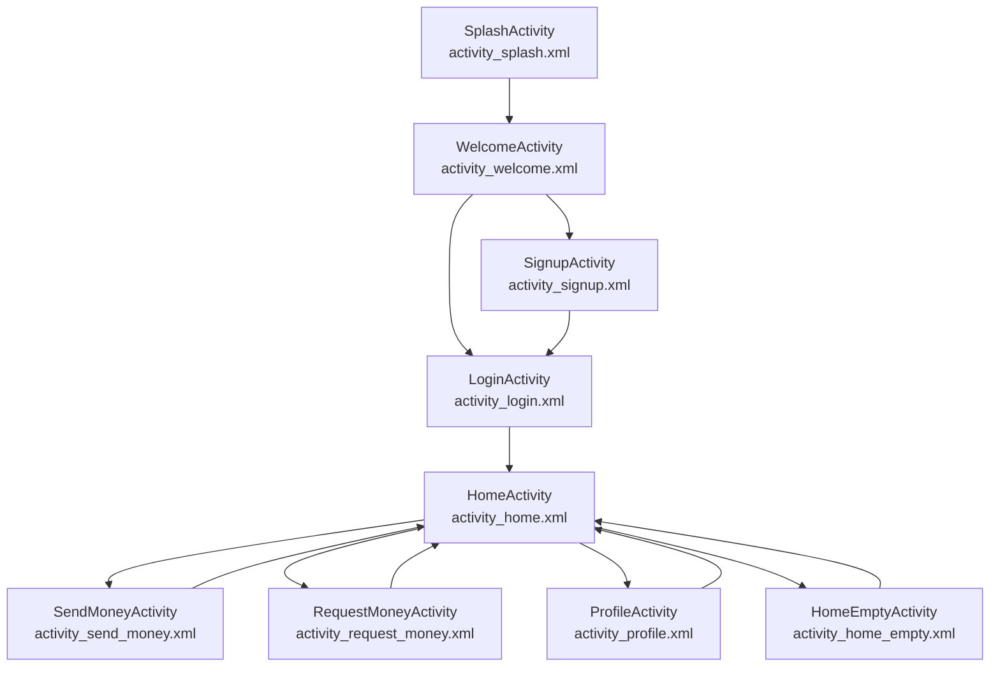

# Alke Wallet

Proyecto de billetera virtual desarrollado como entrega del **Módulo 4** (ABP).

La aplicación se centra en el **diseño de la interfaz y el flujo visual** de una wallet digital, permitiendo simular acciones como iniciar sesión, registrarse, consultar balance y navegar a pantallas para enviar o solicitar dinero. No implementa lógica real de autenticación ni operaciones financieras sobre un backend.

---

## Tecnologías utilizadas

- **Lenguaje:** Kotlin
- **Entorno:** Android Studio
- **UI:** Layouts XML (ConstraintLayout, LinearLayout, etc.)
- **Recursos:** Imágenes, íconos y tipografías exportadas desde Figma

---

## Estructura de carpetas del proyecto

```text
.
├── app
│   ├── build.gradle.kts
│   ├── proguard-rules.pro
│   └── src
│       ├── androidTest
│       │   └── java
│       │       └── com
│       │           └── cjgr
│       │               └── awandroide
│       │                   └── ExampleInstrumentedTest.kt
│       ├── main
│       │   ├── AndroidManifest.xml
│       │   ├── java
│       │   │   └── com
│       │   │       └── cjgr
│       │   │           └── awandroide
│       │   │               ├── MainActivity.kt
│       │   │               └── ui
│       │   │                   ├── HomeActivity.kt
│       │   │                   ├── HomeEmptyActivity.kt
│       │   │                   ├── LoginActivity.kt
│       │   │                   ├── ProfileActivity.kt
│       │   │                   ├── RequestMoneyActivity.kt
│       │   │                   ├── SendMoneyActivity.kt
│       │   │                   ├── SignupActivity.kt
│       │   │                   ├── SplashActivity.kt
│       │   │                   └── WelcomeActivity.kt
│       │   └── res
│       │       ├── color
│       │       │   └── text_input_stroke.xml
│       │       ├── drawable
│       │       │   ├── back_icon.xml
│       │       │   ├── bg_header_celeste.xml
│       │       │   ├── bg_home.xml
│       │       │   ├── bg_input_field_green.xml
│       │       │   ├── bg_input_field.xml
│       │       │   ├── bg_login.png
│       │       │   ├── empty_illustration.xml
│       │       │   ├── ic_back.xml
│       │       │   ├── ic_edit.xml
│       │       │   ├── ic_empty.xml
│       │       │   ├── ic_launcher_background.xml
│       │       │   ├── ic_launcher_foreground.xml
│       │       │   ├── ic_logo_alke.xml
│       │       │   ├── ic_notification.xml
│       │       │   ├── ic_profile.xml
│       │       │   ├── ic_request.xml
│       │       │   ├── ic_send.xml
│       │       │   ├── ic_splash_logo.png
│       │       │   ├── ic_view_password.xml
│       │       │   └── view_icon_1.xml
│       │       ├── layout
│       │       │   ├── activity_home_empty.xml
│       │       │   ├── activity_home.xml
│       │       │   ├── activity_login.xml
│       │       │   ├── activity_main.xml
│       │       │   ├── activity_profile.xml
│       │       │   ├── activity_request_money.xml
│       │       │   ├── activity_send_money.xml
│       │       │   ├── activity_signup.xml
│       │       │   ├── activity_splash.xml
│       │       │   └── activity_welcome.xml
│       │       ├── mipmap-anydpi-v26
│       │       │   ├── ic_launcher_round.xml
│       │       │   └── ic_launcher.xml
│       │       ├── mipmap-hdpi
│       │       │   ├── ic_launcher_round.webp
│       │       │   └── ic_launcher.webp
│       │       ├── mipmap-mdpi
│       │       │   ├── ic_launcher_round.webp
│       │       │   └── ic_launcher.webp
│       │       ├── mipmap-xhdpi
│       │       │   ├── ic_launcher_round.webp
│       │       │   └── ic_launcher.webp
│       │       ├── mipmap-xxhdpi
│       │       │   ├── ic_launcher_round.webp
│       │       │   └── ic_launcher.webp
│       │       ├── mipmap-xxxhdpi
│       │       │   ├── ic_launcher_round.webp
│       │       │   └── ic_launcher.webp
│       │       ├── values
│       │       │   ├── colors.xml
│       │       │   ├── strings.xml
│       │       │   └── themes.xml
│       │       ├── values-night
│       │       │   └── themes.xml
│       │       └── xml
│       │           ├── backup_rules.xml
│       │           └── data_extraction_rules.xml
│       └── test
│           └── java
│               └── com
│                   └── cjgr
│                       └── awandroide
│                           └── ExampleUnitTest.kt
├── build.gradle.kts
├── gradle
│   ├── gradle-daemon-jvm.properties
│   ├── libs.versions.toml
│   └── wrapper
│       ├── gradle-wrapper.jar
│       └── gradle-wrapper.properties
├── gradle.properties
├── gradlew
├── gradlew.bat
├── local.properties
├── README.md
└── settings.gradle.kts
```

> El árbol anterior refleja la estructura real del proyecto, con cada **Activity**, layout y recurso organizado en su carpeta correspondiente.

---

## Flujo de navegación (diagrama Mermaid)



- **SplashActivity:** muestra el logo de Alke Wallet y el nombre de la app al iniciar.
- **WelcomeActivity:** pantalla de bienvenida con opciones para crear cuenta o indicar que el usuario ya tiene cuenta.
- **LoginActivity / SignupActivity:** formularios para iniciar sesión o registrarse (navegación simulada).
- **HomeActivity:** pantalla principal con balance, saludo, transacciones y accesos a funciones clave.
- **SendMoneyActivity / RequestMoneyActivity:** pantallas para ingresar o enviar dinero.
- **ProfileActivity:** pantalla de perfil del usuario.
- **HomeEmptyActivity:** variación de Home sin transacciones.

---

## Pantallas implementadas

### 1. Splash Screen

- Fondo de color sólido de la marca.
- Logo de **Alke Wallet** centrado.
- Nombre de la aplicación bajo el logo.
- Se muestra al iniciar la app durante unos segundos antes de pasar al flujo de bienvenida.

### 2. Login / Signup Page (Welcome)

- Pantalla de bienvenida donde el usuario puede elegir entre **Crear nueva cuenta** o **Ya tiene cuenta**.
- Dividida en dos zonas:
  - Zona superior con fondo celeste y borde inferior redondeado (`bg_header_celeste.xml`), mostrando logo y nombre de la app.
  - Zona inferior con fondo blanco y botones de acción.
- Botón principal **"Crear nueva cuenta"** (fondo celeste, bordes redondeados, texto blanco).
- Texto/botón secundario **"Ya tiene cuenta"** sin fondo, con texto celeste.

### 3. Login Page

- Título descriptivo de la pantalla.
- Campos etiquetados **Email** y **Contraseña**.
- Campo de texto + campo de contraseña con ícono para mostrar/ocultar.
- Texto de ayuda **"Olvidaste tu contraseña"**.
- Fondo con imagen de acuerdo al diseño de Figma.
- Botón primario **"Login"** (fondo celeste, bordes redondeados).
- Botón secundario **"Crear una nueva cuenta"** sin fondo y texto celeste.
- Pulsar **Login** simula la navegación a **HomeActivity** mediante un `Intent`.

### 4. Signup Page

- Título de registro.
- Cinco campos de entrada:
  - Tres de texto (nombre completo, email, confirmación de email u otros datos).
  - Dos de contraseña con opción de visualización.
- Fondo con imagen.
- Botón principal para confirmar el registro (celeste, bordes redondeados).
- Botón secundario para volver al Login, sin fondo y texto celeste.

### 5. Home Page

- Fondo celeste con imagen/degradado en la cabecera.
- Textos principales: **Inicio**, saludo al usuario, **Balance** y monto disponible.
- Imagen de perfil y campanita de notificaciones.
- Sector blanco inferior con botones:
  - **Enviar dinero** (fondo verde, bordes redondeados).
  - **Ingresar dinero** (fondo celeste, bordes redondeados).
- Lista de transacciones con avatar, nombre, ícono de tipo (ingreso/envío), fecha y monto con signo.

### 6. Home Page – Empty Case

- Misma estructura que HomeActivity.
- Sin transacciones: se muestra un estado vacío con ilustración y mensaje indicando que aún no hay movimientos.

### 7. Profile Page

- Barra superior gris con el texto **Mi perfil**.
- Imagen de perfil con bordes redondeados y círculo blanco de fondo.
- Nombre de usuario con ícono de lápiz para edición.
- Sector blanco con cuatro filas tipo tarjeta: ícono, texto y flecha de navegación.

### 8. Send Money (Ingresar dinero)

- Ícono de flecha y título **Ingresar dinero**.
- Línea divisoria bajo la cabecera.
- Bloque con datos del usuario/destinatario: foto, nombre y correo.
- Textos guía **Cantidad a ingresar** y **Nota de transferencia**.
- Campos de usuario:
  - Campo numérico con borde celeste.
  - Campo de texto para la nota.
- Botón **Ingresar dinero** (color celeste, bordes redondeados).

### 9. Request Money (Enviar / Solicitar dinero)

- Ícono de flecha y título **Enviar dinero**.
- Línea divisoria bajo la cabecera.
- Perfil del contacto con inicial, nombre y correo.
- Textos guía **Cantidad a ingresar** y **Nota de transferencia**.
- Campos de usuario:
  - Campo numérico con borde verde.
  - Campo de texto para la nota.
- Botón principal **Ingresar dinero** (celeste, bordes redondeados).

---

## Cómo ejecutar el proyecto en local

1. **Clonar el repositorio**

   ```bash
   git clone https://github.com/tu-usuario/AlkeWallet.git
   cd AlkeWallet
   ```

2. **Abrir el proyecto en Android Studio**

   - Abrir Android Studio.
   - Menú **File > Open**.
   - Seleccionar la carpeta del proyecto clonada.
   - Esperar a que Gradle termine de sincronizar.

3. **Configurar SDK y dispositivo/emulador**

   - Asegurarse de tener instalado el **Android SDK** compatible con el `compileSdk` del proyecto.
   - Crear un **AVD** (Android Virtual Device) o conectar un dispositivo físico con depuración USB.

4. **Construir el proyecto**

   - Menú **Build > Make Project**.
   - Si aparecen errores de recursos (por ejemplo, atributos duplicados en algún `TextView`), revisar los archivos XML indicados en el mensaje y corregirlos.

5. **Ejecutar la app**

   - Seleccionar el emulador/dispositivo en la barra de herramientas.
   - Pulsar **Run** (▶️) o usar **Run > Run 'app'**.
   - La app se instalará y abrirá mostrando primero la **Splash Screen** y luego la pantalla **Welcome** con las opciones de Login y Signup.

6. **Explorar el flujo completo**

   - Desde **WelcomeActivity**, navegar a **LoginActivity** o **SignupActivity**.
   - Completar el formulario y avanzar a **HomeActivity** (navegación simulada por `Intent`).
   - Desde **HomeActivity**, acceder a **SendMoneyActivity**, **RequestMoneyActivity**, **ProfileActivity** y a la variación **HomeEmptyActivity**, y luego volver.

---

## Autor

Proyecto desarrollado como parte del **Módulo 4 - Alke Wallet** dentro del programa de formación en desarrollo Android.
